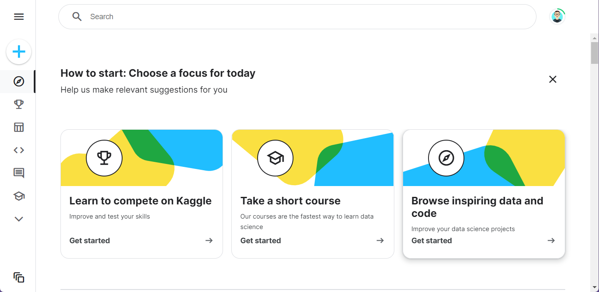

# 데이터셋 및 커널

캐글에 로그인 하면 첫화면이 아래와 같이 나타납니다.

<figure><figcaption>
index page
</figcaption></figure>

왼쪽에 중요한 메뉴가 Home, Competitions, Datasets, Code, Discussions, Learn 순으로 나열되어 있습니다.

여기서 Competitions는 여러 데이터 분석 경진대회 메뉴이고, Datasets는 다른 캐글러들이 분석에 필요한 데이터들을 공개한 페이지입니다. 여기에서 필요한 데이터도 다운로드 받아서 학습할 수 있습니다.

Learn이라는 학습 페이지도 있습니다. 영어에 자신이 있다면 여기에서 파이썬 및 데이터분석에 대해서 학습하여도 됩니다.&#x20;

Competitions와 Learn에서 동일하게 사용할 수 있는 커널이 존재합니다. 주피터 노트북이 실행된다고 생각하면 되겠습니다.

