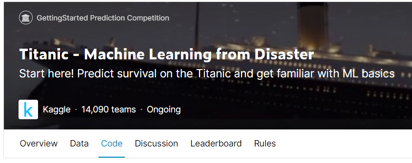

# 타이타닉 생존자 분석


먼저 Titanic - Machine Learning from Disaster 를 클릭합니다. 화면에 영어로 된 내용을 읽기 귀찮다면 구글의 번역기능을 활용하세요.


Titanic


머신러닝으로 타이타닉에서 살아남은 승객을 예측하는 모델을 만드는 내용입니다.

타이타닉에 대한 내용은 위키피디아를 통해서 확인바랍니다.

{% embed url="https://ko.wikipedia.org/wiki/RMS_%ED%83%80%EC%9D%B4%ED%83%80%EB%8B%89" %}

<figure><figcaption></figcaption></figure>

위와 같이 하위 메뉴로 Overview, Data, Code, Discussion 등의 내용이 존재합니다.

첫번째 챌린지인 타이타닉은 '어떤 종류의 사람들이 생존할 가능성이 더 높았는지'에 대한 답변을 위한 모델을 구축하는 것입니다. 승객 데이터에는 이름, 나이, 성별, 사회적 경제계층 등의 컬럼이 존재합니다.

위의 내용은 Overview 에 나와 있는 내용입니다.

Data라는 하위 메뉴 탭에서 어떠한 데이터가 존재하는 지 알 수 있습니다. 현재는 세개의 데이터가 존재하는데 gender\_submission.csv, train.csv, test.csv 입니다. 오프라인으로 다운로드 받아서 직접 노트북을 운용해도 되지만, 여기서는 커널을 통해 바로 캐글의 개발환경을 사용하도록 하겠습니다.

세번째 Code를 누르면서 커널을 시작할 수 있습니다. 하위메뉴 오른쪽 끝에 'New Notebook'이라는 버튼이 보이면 이를 클릭합니다.

구글 코랩과 같은 화면이 나타납니다.&#x20;

먼저 커널의 제목을 작성합니다. 여기서는 'Titanic prediction - Step by step' 이라고 작성했습니다.

### 분석을 시작합시다

커널 내에 마크다운을 추가하고 아래와 같이 적습니다.

```
# Titanic 

커널을 시작합니다. 아래의 사이트를 참조했습니다.
```

다시 마크다운을 추가하고 아래의 내용을 적습니다

```
## 1 라이브러리 로드
```

아래의 라이브러리 로드 코드는 캐글에서 제공해주는 기본 소스를 그대로 사용해도 무방합니다.

```
# It is defined by the kaggle/python Docker image: https://github.com/kaggle/docker-python
import numpy as np # linear algebra
import pandas as pd # data processing, CSV file I/O (e.g. pd.read_csv)

# Input data files are available in the read-only "../input/" directory
# For example, running this (by clicking run or pressing Shift+Enter)
import os
for dirname, _, filenames in os.walk('/kaggle/input'):
    for filename in filenames:
        print(os.path.join(dirname, filename))

# You can write up to 20GB to the current directory (/kaggle/working/) ...
# You can also write temporary files to /kaggle/temp/, but they won't be saved ...
```

이 부분을 실행하면 결과 메시지가 출력됩니다. 이는 여기 커널의 아래에서 다음과 같은 입력파일을 사용할 수 있다는 얘기입니다.

```
/kaggle/input/titanic/train.csv
/kaggle/input/titanic/test.csv
/kaggle/input/titanic/gender_submission.csv
```

추가적인 라이브러리를 위하여 코드를 추가합니다.

```
# 데이터 시각화 관련
import matplotlib.pyplot as plt
import seaborn as sns
```

마크다운을 추가합니다.

```
## 2 입력데이터 로드 및 확인
```

위에서 나왔던 세가지 입력데이터 중에서 train.csv를 먼저 읽어와 보겠습니다.

```
# 훈련 데이터 로드
train = pd.read_csv('/kaggle/input/titanic/train.csv')
train.tail()
```

<figure><figcaption><p>train data</p></figcaption></figure>

위와 같이 보면 총 890까지 데이터가 나와 있습니다. 인덱스는 0부터 시작하기 때문에 총 891개의 데이터가 존재하는 것을 알 수 있습니다. 여기에서의 특이점은 Age, Cabin에 NaN이 보이는 것입니다. 값이 없다는 뜻이죠.

테스트 데이터도 로드합니다.

```
# 테스트 데이터 로드
test = pd.read_csv('/kaggle/input/titanic/test.csv')
test.tail()
```

훈련 데이터의 정보를 확인해보면,

```
train.info()
# 총 891개의 데이터 중에서 Age와 Cabin, Embarked에서 결측치가 확인됨
```

아래와 같이 결과가 나옵니다.

```
<class 'pandas.core.frame.DataFrame'>
RangeIndex: 891 entries, 0 to 890
Data columns (total 12 columns):
 #   Column       Non-Null Count  Dtype  
---  ------       --------------  -----  
 0   PassengerId  891 non-null    int64  
 1   Survived     891 non-null    int64  
 2   Pclass       891 non-null    int64  
 3   Name         891 non-null    object 
 4   Sex          891 non-null    object 
 5   Age          714 non-null    float64
 6   SibSp        891 non-null    int64  
 7   Parch        891 non-null    int64  
 8   Ticket       891 non-null    object 
 9   Fare         891 non-null    float64
 10  Cabin        204 non-null    object 
 11  Embarked     889 non-null    object 
dtypes: float64(2), int64(5), object(5)
memory usage: 83.7+ KB
```

이 얘기는, 총 데이터 891 중에 Age 컬럼은 177개, Cabin은 687개, Embarked는 2개의 결측치(NaN)가 존재합니다. 이를 주의해야 합니다. test도 동일하게 확인해보면, Age 86개, Fare 1개, Cabin 327개의 결측치가 존재합니다.

### 이제 진짜 데이터분석

마크다운을 추가합니다.

```
## 3 데이터 분석

train에는 PassengerId ~ Embarked 까지 12개의 컬럼, test는 Survived를 제외하고 동일하게 존재합니다.
데이터수는 train은 891개, test는 418개이나, 내용 중에 891개, 418개를 가지지 못한 데이터 컬럼이 존재합니다.
```

결측치는 어떻게 할까요? 또한, 아래와 같은 내용을 고민해 봐야 합니다.

* 결측치가 포함된 데이터는 버린다
* 기본값(중앙값, 평균값 등)을 채운다
* 데이터의 형변환이 가능한가

